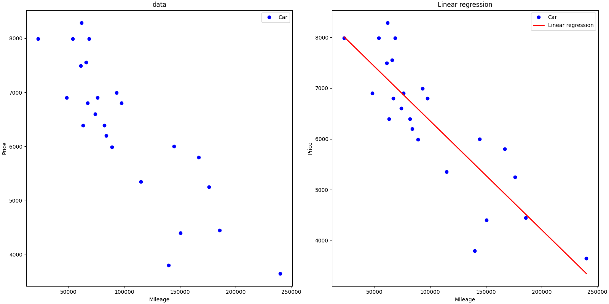

## Introduction

Une introduction à l'apprentissage automatique.

La régression linéaire est une méthode permettant de réaliser des prédictions ou des estimations. À l’aide d’un algorithme d’apprentissage supervisé, une relation linéaire est déterminée entre une variable dépendante et une ou plusieurs variables explicatives

## Summary

CALCUL DE LA DROITE DE REGRESSION:
$$f(x) = (theta1*x) + theta0  $$

_gradient descent_

$$
\begin{align}
\frac{\partial J(w,b)}{\partial w} &= \frac{1}{m} \sum_{i = 0}^{m-1} (f_{w,b}(x^{(i)}) - y^{(i)})x^{(i)} \\
\frac{\partial J(w,b)}{\partial b} &= \frac{1}{m} \sum_{i = 0}^{m-1} (f_{w,b}(x^{(i)}) - y^{(i)})
\end{align}
$$

les paramètres $theta1$, $theta0$ sont mis à jour simultanément.

$$
\begin{align*}
\  w &= w -  \alpha \frac{\partial J(w,b)}{\partial w}  \; \newline
 b &= b -  \alpha \frac{\partial J(w,b)}{\partial b}  \newline
\end{align*}
$$

les données d'apprentissage pour ajuster les paramètres $theta1$, $theta0$ en minimisant une mesure de l'erreur entre nos prédictions $f(x)$ et les données réelles $y$. Cette mesure s'appelle le $coût$, $J(theta1,theta0)$. Lors de l'apprentissage, on mesure le coût sur tous les échantillons d'apprentissage $x^{(i)},y^{(i)}$
$$J(w,b) = \frac{1}{2m} \sum\limits_{i = 0}^{m-1} (f(x^{(i)}) - y^{(i)})^2$$

## usage

1. Installez les paquets Python requis :

```
pip3 install -r requirement.txt
```

2. Train le modèle :

```
python3 train.py
```

3. Faites des predictions :

```
python3 predictPrice.py
```

4. graph :

```
 python3 reander.py
```

<picture>
  
</picture>

### resource

[Machine Learning - Linear Regression and Gradient Descent](https://www.youtube.com/watch?v=4b4MUYve_U8&t=4003s)

[Linear regression](https://en.wikipedia.org/wiki/Linear_regression)

